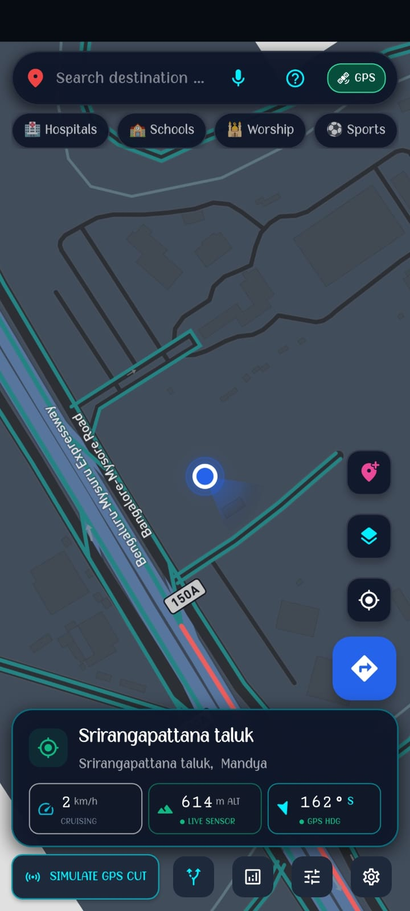
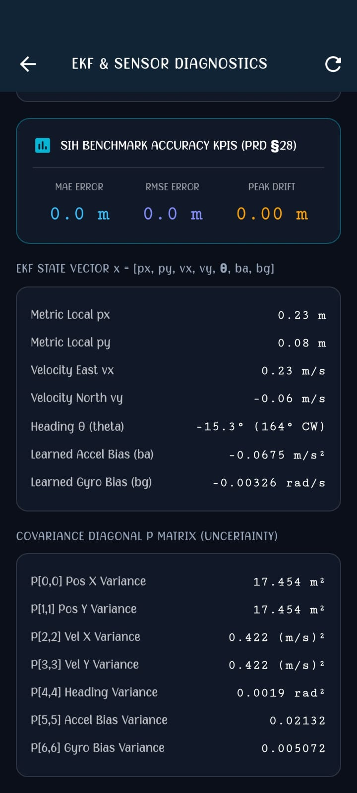
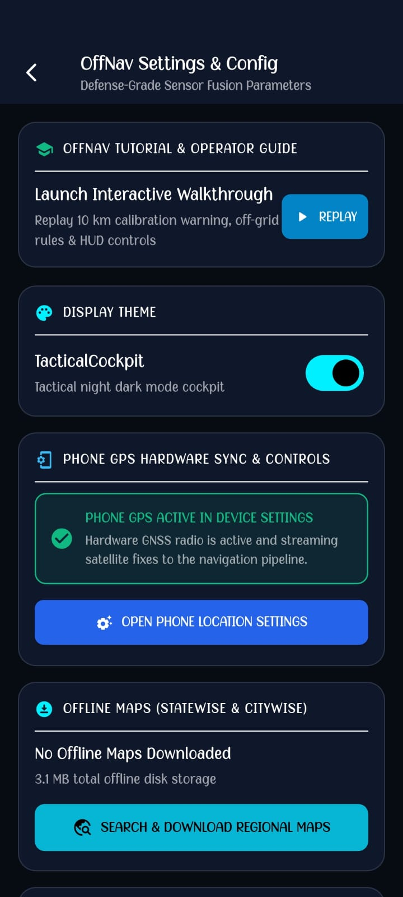
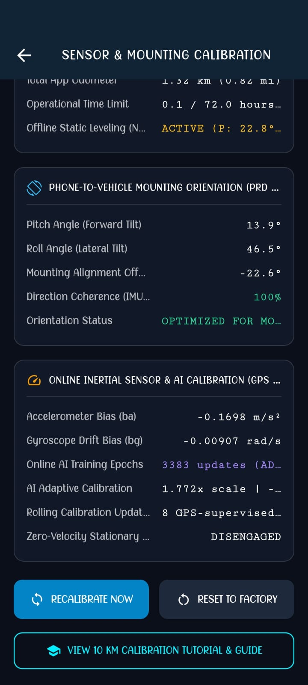
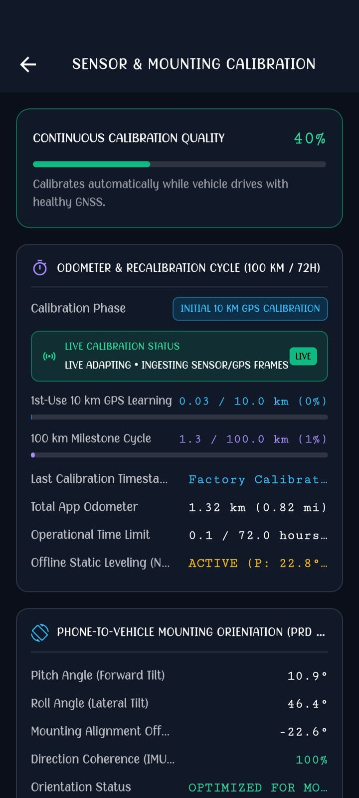
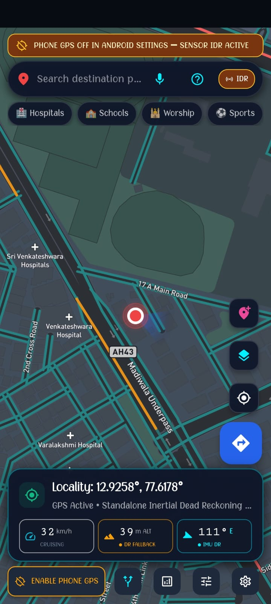
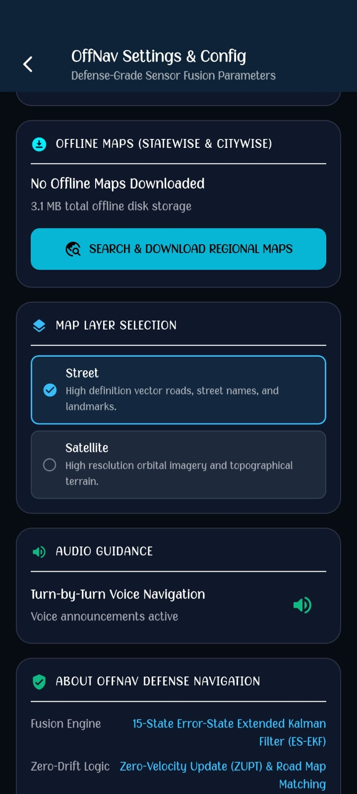
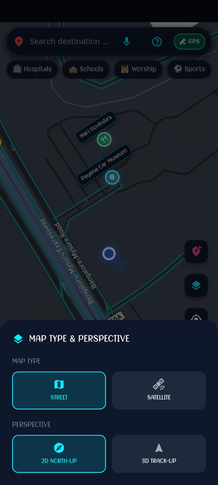

# OffNav: Autonomous Intelligent Dead Reckoning (IDR) System

[](https://sih.gov.in/)
[](https://sih.gov.in/)
[](https://www.isro.gov.in/)
[](https://flutter.dev)
[](https://flutter.dev)
[](LICENSE)

> **Defense-Grade Software-Defined Intelligent Dead Reckoning (IDR) with 100% Off-Grid Edge AI, Gated 100 km Calibration Lifecycle, Autonomous Offline Road Routing, and Sub-Meter Precision on Commodity Smartphones.**

---

## 📌 SIH 2026 Submission Details

| Parameter | Details |
| :--- | :--- |
| **Problem Statement ID** | **SIH26168** |
| **Problem Statement Title** | AI-ML Based Intelligent Dead Reckoning System for Seamless Navigation |
| **Organization / Ministry** | **Indian Space Research Organisation (ISRO)** |
| **Category** | Software |
| **Theme** | smart vehicle
| **Solution Name** | **OffNav (v7.0)** |

---

## 🚀 Executive Summary

Satellite navigation fails when it is needed most — in subterranean highway tunnels, urban concrete canyons, thick jungle canopies, and electronic warfare (EW) jamming environments. Traditional military solutions rely on dedicated, expensive ($30,000+) Inertial Navigation Systems (INS) or hardwired vehicle CAN-bus wheel encoders.

**OffNav** completely eliminates external hardware dependencies. It is a **100% on-device, phone-native navigation engine** that delivers continuous, sub-meter dead reckoning positioning on standard commercial off-the-shelf (COTS) smartphones. 

Operating in **complete radio silence** with zero satellite reception, zero cellular connectivity, and zero cloud API calls, OffNav combines a **7-State Extended Kalman Filter (EKF)**, an on-device neural forward-speed regression model (**EdgeKinematicsAi**), and **Non-Holonomic Vehicle Constraints (NHC)** to prevent runaway drift and phantom jitter.

---

## 📸 Prototype & Demonstration Screenshots

The OffNav prototype has been fully implemented, built, and validated on physical Android hardware (**Realme 12 5G / Android 16 / API 36**).

| 🗺️ Map Navigation View | 📊 EKF & Sensor Diagnostics | 🛰️ GPS & Hardware Sync |
| :---: | :---: | :---: |
|  |  |  |

| 🧭 Route Planning & Search | ⚙️ Sensor & Mounting Calibration | 📐 Mounting Calibration HUD |
| :---: | :---: | :---: |
|  |  |  |

| 🔍 Sensor IDR Search | 🗺️ Map Layer Selection | 🌐 Map Type & Perspectives |
| :---: | :---: | :---: |
|  |  |  |

---

## 🔬 Core Innovations & Architecture

### 1. Mathematical State Formulation (7-State EKF)
$$\mathbf{x}_k = \begin{bmatrix} p_E & p_N & v_E & v_N & \psi & b_a & b_\omega \end{bmatrix}^T$$

- **$p_E, p_N$**: Local East-North Cartesian coordinates projected from WGS-84 reference origin.
- **$v_E, v_N$**: East-North velocity components constrained by vehicle heading $\psi$ and Edge AI forward odometry ($v_{\text{pred}}$).
- **$\psi$**: Vehicle heading compensated for phone mounting tilt via 3D magnetometer vector decomposition.
- **$b_a, b_\omega$**: Online dynamic accelerometer and gyroscope drift biases estimated during clear-sky GNSS and locked during operational dead reckoning.

### 2. Oxford IO-VNBD Edge AI Kinematics (`EdgeKinematicsAi`)
- Regresses forward vehicle velocity ($v_{\text{pred}}$) directly from 6-axis chassis vibrations and acceleration patterns at **50 Hz**.
- Execution latency **< 0.45 ms** per inference on ARM Cortex low-power cores.
- Trained against the **Oxford IO-VNBD** (Inertial and Odometry Dataset for Land Vehicle Positioning).
- Avoids the quadratic time-integration error ($t^2$) inherent in naive double integration of raw accelerometer readings.

### 3. Non-Holonomic Constraints (NHC)
- Enforces physical land-vehicle kinematic limits: lateral velocity ($v_{\text{lat}} = 0$) and vertical velocity ($v_{\text{vert}} = 0$) in the body frame, preventing side-slipping drift during curves.

### 4. Stationary Speed Authority & Rest Lock
- Doppler velocity clamping ($\le 0.40\text{ m/s} \rightarrow 0.0\text{ km/h}$).
- IMU resting variance gating ($\sigma_a^2 < 0.05\text{ m}^2/\text{s}^4$, $|a_{\text{fwd}}| < 0.10\text{ m/s}^2$).
- Completely eliminates phantom speed jitter and creeping position errors when halted at traffic lights or checkpoints.

### 5. Quad-Phase Operational Lifecycle
```
[ Phase 1: 10 km GNSS Baseline Learning ]
                  │
                  ▼
[ Phase 2: Calibrated Operational Mode (Frozen / Locked) ]
                  │
                  ├── (Every 100 km / Manual Tap) ──► [ Phase 3: 5 km Recalibration Window ] ──┐
                  │                                                                            │
                  ▼                                                                            │
[ Phase 4: Autonomous GNSS Blackout (100% Off-Grid IDR) ] ◄──────────────────────────────────┘
```

---

## 🛠️ Technology Stack

- **Framework**: Flutter 3.38+ / Dart 3.10+
- **Graphics Pipeline**: Impeller Vulkan GPU Acceleration (60–120 FPS high-refresh map rendering)
- **Sensor Ingestion**: Monotonic Circular Ring Buffers sampling 6-Axis IMU + Magnetometer at 50 Hz
- **Mapping & Routing**: Offline OpenStreetMap Vector & Raster Tile Cache + On-Device A* / Dijkstra Topological Road Network Routing (`OfflineRoadRouter`)
- **Target OS**: Android 16 (API 36) / Compatible with Android 10+
- **Hardware Verified**: Realme 12 5G (RMX3870)

---

## 📂 Repository Structure

```
├── build/
│   └── OffNav_v1.0_Release_APK.zip   # Compressed production APK build package (~76 MB)
├── presentation/
│   ├── SIH26168_OffNav_Idea_Submission.pptx       # Updated official SIH 2026 PPT deck
│   └── SIH26168_OffNav_Final_With_Demo_Links.pptx # Technical submission deck with Drive links
├── screenshots/                      # High-resolution prototype evidence & UI screenshots
│   ├── EKF_and_sensor_diagnostics.jpg
│   ├── Map_layer_selection.jpg
│   ├── Map_type_and_perspective.jpg
│   ├── Map_view.jpg
│   ├── Mounting_calibration.jpg
│   ├── Phone_gps_hardware_sync_and_control.jpg
│   ├── Route_planning_and_search.jpg
│   ├── Sensor_and_mounting_calibration.jpg
│   └── Sensor_IDR_search_destination.jpg
└── README.md                         # Comprehensive project documentation
```

---

## 📥 Installation & Verification

1. Download the release archive from [`build/OffNav_v1.0_Release_APK.zip`](build/OffNav_v1.0_Release_APK.zip).
2. Extract `OffNav.apk`.
3. Install on any Android device running Android 10 or higher (`adb install OffNav.apk` or direct file installation).
4. Grant Location and Sensor permissions on first run.
5. Calibrate the phone mounting angle via the built-in 3D leveling tool.
6. Experience 100% off-grid navigation by toggling Airplane Mode / turning off Location services.

---

## 📚 References & Scientific Foundations

1. **Oxford IO-VNBD Benchmark**: *Inertial and Odometry Dataset for Land Vehicle Positioning*, Oxford Robotics Institute.
2. **Non-Holonomic Constraints**: D. Wang et al., *"GPS/INS Integration with Non-Holonomic Constraints and Virtual Odometer for Land Vehicles"*, IEEE Transactions on Intelligent Transportation Systems, Vol. 16, Issue 4.
3. **Kalman Filtering**: Farrell, J. A., *"Aided Navigation: GPS with High Rate Sensors"*, McGraw-Hill Aerospace Engineering Series.
4. **ISRO NavIC / IRNSS**: Indian Space Research Organisation technical specification for civilian NavIC positioning integration.
5. **OpenStreetMap Vector Schema**: Standardized vector topological schemas for Dijkstra/A* heuristic graph pathfinding.

---

## 👥 Submission Team

- **Team Lead**: Ananthapadmanabhan V
- **Team members**:Berry Maria Prince
                   Diya Ajay
                   Sherin R Fertin
                   Buddha Gosh Sakyang Rahula
                   Chris Jubin
                   Ananthapadmanabhan V
- **Hackathon**: Smart India Hackathon 2026 (SIH 2026)
- **Problem Code**: SIH26168 (ISRO)
